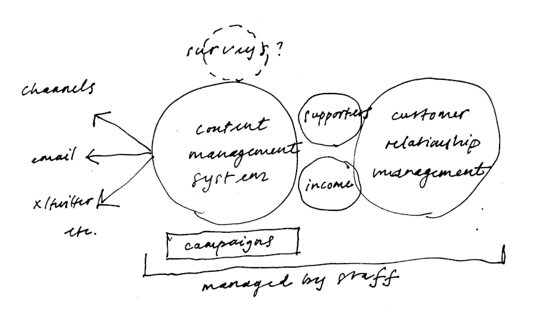

# coherent charity system

15 January 2025

This README sets out a design for a Software as a Service (or SaaS)
system for charities that are funded through digital campaigns. The name
"coherent charity system" (CCS) is a working title.

## Introduction

The focus of the design is to provide a simple, coherent system that
will help charities of 10-100 staff work more effectively on digital
campaigns and with customers while linking with digital channels and
payment providers.

The system is intended to be open source.

## Environment

Many charities that depend on digital campaigns to finance their work
depend on a variety of different digital solutions to achieve their
aims. These solutions typically span several functions and services,
including a website (usually Wordpress), email campaign services (such
as Mailchimp), survey facilities (such as Survey Monkey), payment
provision such as Stripe and website analytics services, amongst others.
Additionally the data from these discrete services may be aggregated
either ad-hoc or through a system such as SalesForce or Google's
BigQuery. Furthermore, the charity may use a CRM system included in one
of the systems above, or standalone, to track corporate funding
opportunities.

The use of discrete systems introduces the complication that to be
meaningful it needs to be joined by a common data point, normally an
individual's email address. Joining in this manner has the complication
of being imperfect and post-facto.

## The opportunity

At heart the capabilities required centre on a service to provide
charity staff with a way of joining campaigns and both individual and
corporate customer relations through campaigns disseminated over 
various digital channels leading to effective funding.

Data on campaign popularity and funding would be real time.

## Some details

The CCS is envisaged to give staff the means to draft and publish online
website articles collected into campaigns and disseminate these over
various digital channels including email and X/twitter. The system will
link with payment providers and show real-time financial data for each
campaign together with overall income. The system will record and show
staff real-time data.

The service will allow individuals or corporates to support campaigns
(or the charity overall) and offer the facilities of a personal or
corporate secure profile area.

For charity staff the CSS will provide a simple customer relationship
and support system to manage corporate opportunities, provide support
and coordinate with subcontractors.

CCS aims to make charity campaigning and customer support more effective
so that more charity resources can be focused on the charity's mission.

